 # Git 基础教程

### 1.什么是git
#### 1.1 git简史
Git是一个开源的**分布式版本控制系统**，用于敏捷高效地处理任何或小或大的项目。
Git 是 Linus Torvalds 为了帮助管理 Linux 内核开发而开发的一个开放源码的版本控制软件。
Git 与常用的版本控制工具 CVS, Subversion 等不同，它采用了分布式版本库的方式，不必服务器端软件支持。

 **什么是版本控制？**
什么是版本控制？我为什么要关心它呢？版本控制是一种记录一个或若干文件内容变化，以便将来查阅特定版本修订情况的系统。在本书所展示的例子中，我们仅对保存着软件源代码的文本文件作版本控制管理，但实际上，你可以对任何类型的文件进行版本控制。

如果你是位图形或网页设计师，可能会需要保存某一幅图片或页面布局文件的所有修订版本（这或许是你非常渴望拥有的功能）。采用版本控制系统（VCS）是个明智的选择。有了它你就可以将某个文件回溯到之前的状态，甚至将整个项目都回退到过去某个时间点的状态。你可以比较文件的变化细节，查出最后是谁修改了哪个地方，从而找出导致怪异问题出现的原因，又是谁在何时报告了某个功能缺陷等等。使用版本控制系统通常还意味着，就算你乱来一气把整个项目中的文件改的改删的删，你也照样可以轻松恢复到原先的样子。但额外增加的工作量却微乎其微。

**注：** Ctrl+Z 的效果是撤销，每次核销后都会变到以前的样子，就想比较相似版本控制，记录你提交的每次变化（历史版本）。

---
 **什么是分布式系统？**
想要了解点链接
https://baike.baidu.com/item/%E5%88%86%E5%B8%83%E5%BC%8F%E7%B3%BB%E7%BB%9F/4905336?fr=aladdin

#### 1.2 git安装

**window安装**

下载安装包：
https://www.git-scm.com/download/
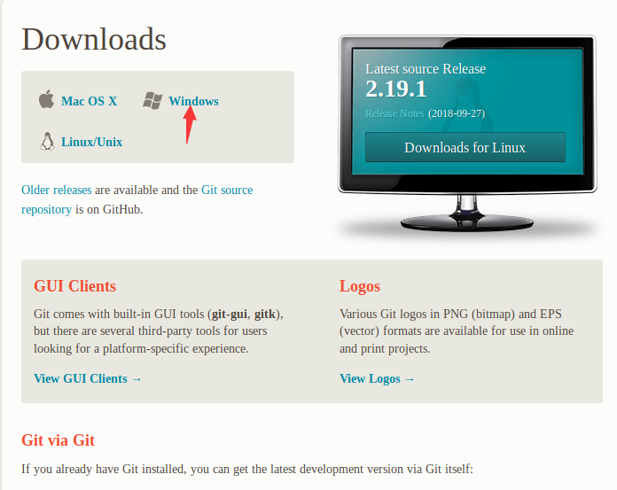

双击打开之后安装一路next.......直到完成。

**注：** 可以任意更改安装地方，应用不要都安装在C盘。

 **Linux安装**

**Ubuntu:**  

>$ sudo apt-get install git

相关详细配置可见：https://blog.csdn.net/qq282330332/article/details/51855252

**Centos:**   

>$ yum install git 

相关详细配置可见：
https://www.jb51.net/article/128153.htm

#### 1.3 git初始操作（以window系统为例）

桌面空白处右击鼠标

**注：** Git GUL Here 是图形化界面，图形化界面很丑很难控制。

下图为命令行界面

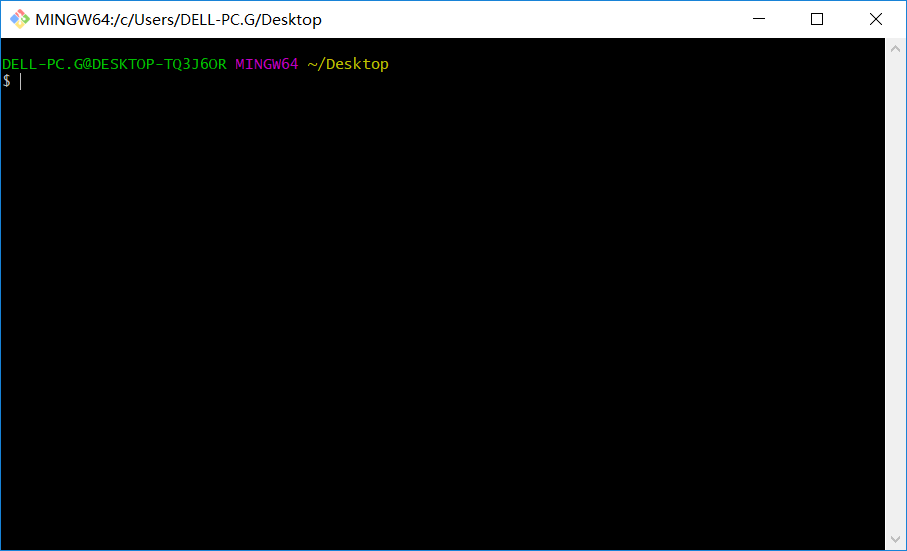
---
**初始化：**
初始化输入用户名和邮箱

    $ git config --global user.name "您的用户名"
    $ git config --global user.email "您的邮箱"

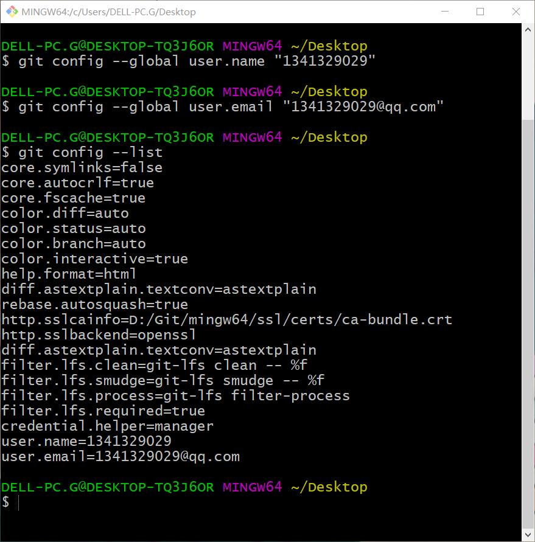

 验证配置修改和有关更多信息和命令行选项

    $ git config --list
    $ git --help

### 2.Github的使用和操作

#### 2.1 什么是Github

gitHub是一个面向开源及私有软件项目的托管平台，因为只支持git 作为唯一的版本库格式进行托管，故名gitHub。

**详细请见：** https://baike.baidu.com/item/github/10145341?fr=aladdin

#### 2.2 Github的登录和注册

**官网：** https://github.com/

注册：
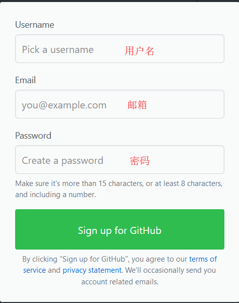

**注：** 与微信用户名类似，可以登录使用，不是进去后的博客名

**详细请见：** https://jingyan.baidu.com/article/4ae03de3d6f9c53eff9e6bdd.html

<b>Sign in</b>是登录<b>Sign up</b>是注册

点击Sign in 进入登录界面
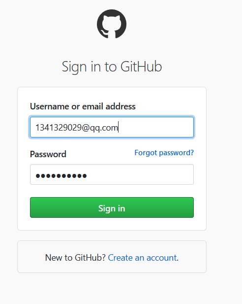

登录后出现主页面

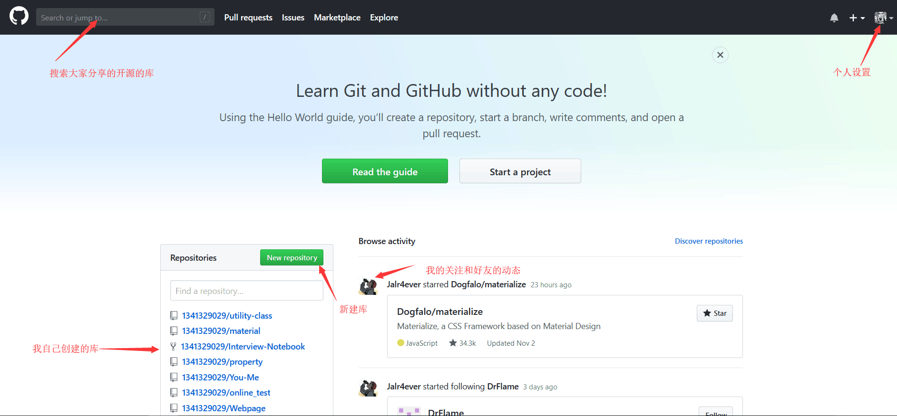

#### 2.3 Github新建库

点击主页面新建库

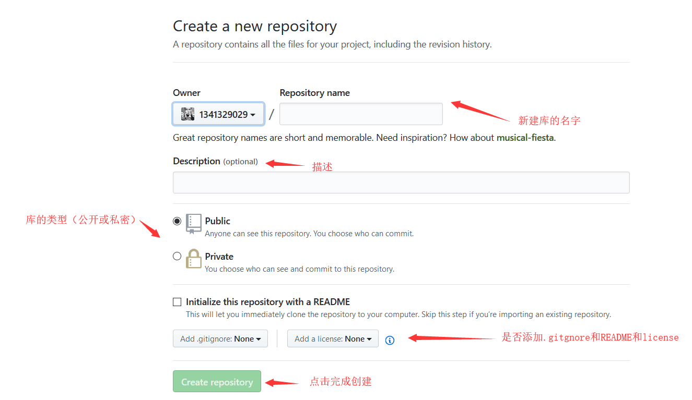

填写完毕点击完成创建

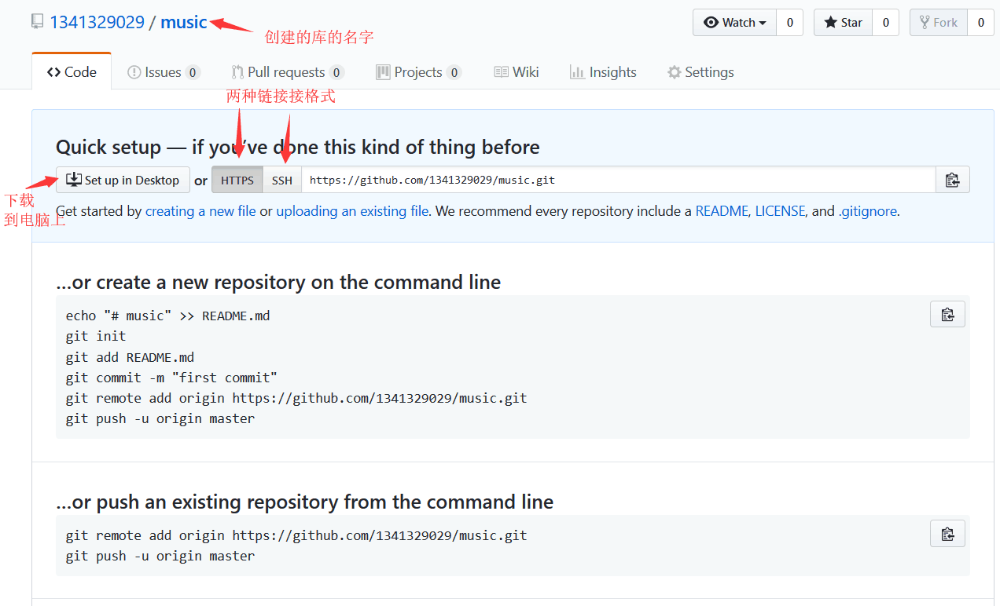

### 3.Git的操作及使用

#### 3.1 Github与git连接（1）
基础Linux命令：

cd : 进入下级目录
ls： 显示目录下文件和文件夹
mkdir: 创建文件夹
rm : 删除

>$ mkdir 文件夹名字

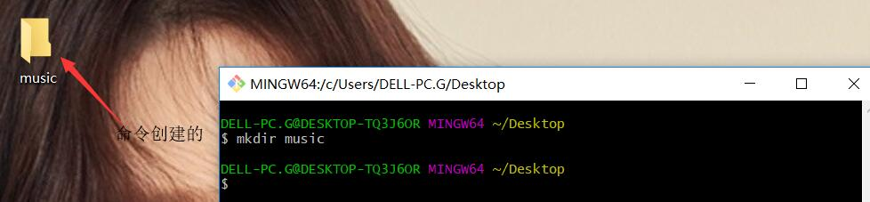

 
---
显示目录下的文件

>$ls 

进入music文件夹下
>$cd music

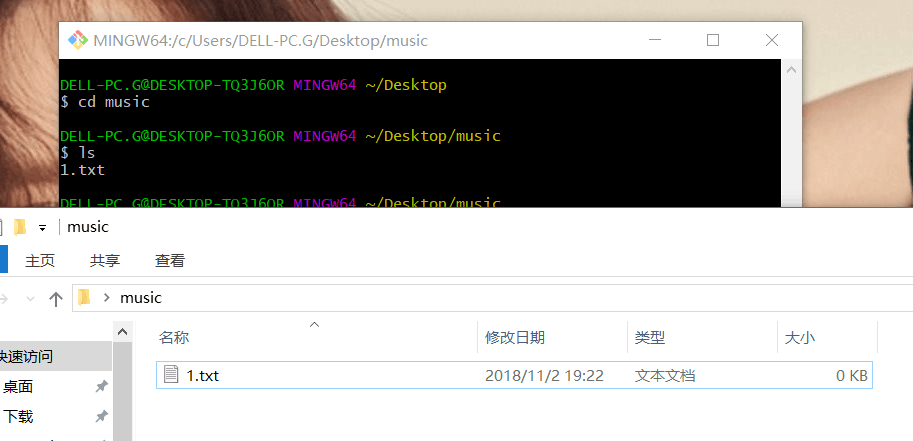

---
写入music到 README.md 文件中 
**注：** 文件md格式和不要求掌握
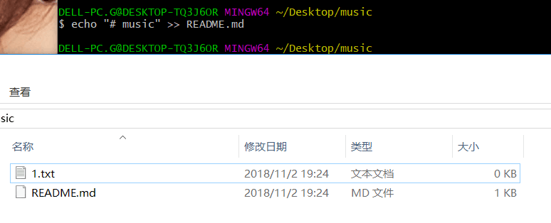
1.创建一个名为 .git 的子目录
> $ git init

该命令将创建一个名为 .git 的子目录，这个子目录含有你初始化的 Git 仓库中所有的必须文件，这些文件是 Git 仓库的骨干。 但是，在这个时候，我们仅仅是做了一个初始化的操作，你的项目里的文件还没有被跟踪。、

2.提交的文件
> $ git add +文件

此命令将要提交的文件的信息添加到索引库中(将修改添加到暂存区)，以准备为下一次提交分段的内容。 它通常将现有路径的当前内容作为一个整体添加，但是通过一些选项，它也可以用于添加内容，只对所应用的工作树文件进行一些更改，或删除工作树中不存在的路径了。

3.提交文件的描述
> $ git commit -m "描述"

4.添加远程仓库的关联
> $ git remote add origin 网址

5.推到远程库中
> $ git push -u origin master

使用本地引用更新远程引用，同时发送完成给定引用所需的对象。可以在每次推入存储库时，通过在那里设置挂钩触发一些事件。

    $ git init 
    $ git add README.md
    $ git commit -m "first commit"
    $ git remote add origin 网址
    $ git push -u origin master

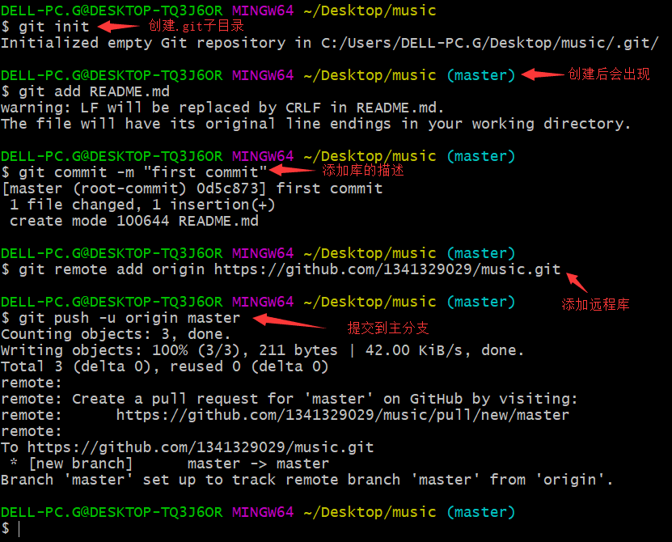

---
远程库显示

#### 3.2 Github与git连接（2）
    
1.复制网址
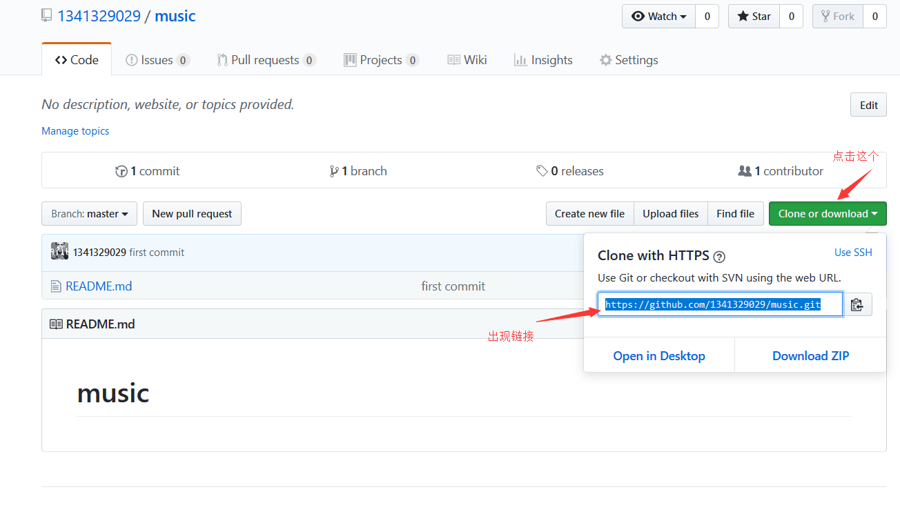

2.克隆

> $ git clone 网址

将存储库克隆到新创建的目录中，为克隆的存储库中的每个分支创建远程跟踪分支(使用git branch -r可见)，并从克隆检出的存储库作为当前活动分支的初始分支。

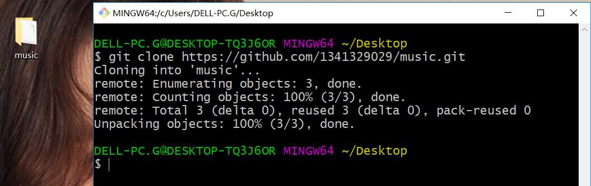
---
3.查看状态

> $ git status

git status命令用于显示工作目录和暂存区的状态。使用此命令能看到那些修改被暂存到了, 哪些没有, 哪些文件没有被Git tracked到。git status不显示已经commit到项目历史中去的信息。看项目历史的信息要使用git log.

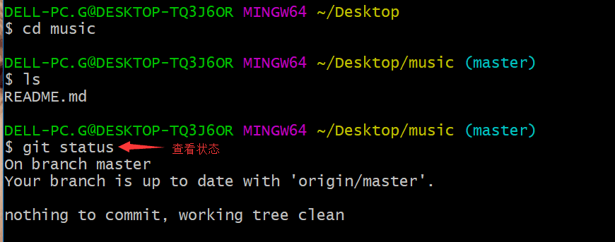

---
没有加到暂存区

 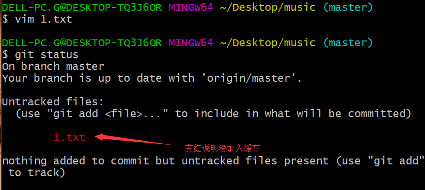
---
通过git add 加入暂存区

 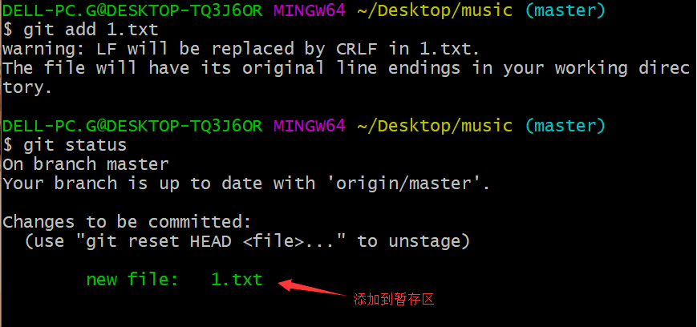
---
 4.添加描述，进行提交

    $ git commit -m ""
    $ git push -u origin master

 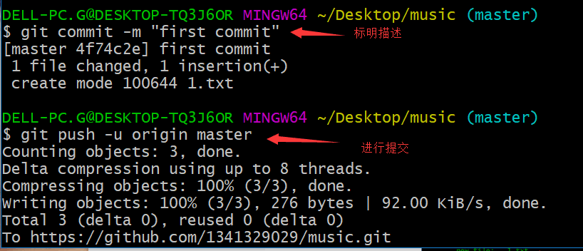

#### 3.3 Github与git连接（3）--文件反复提交

1.新增文件2.txt

 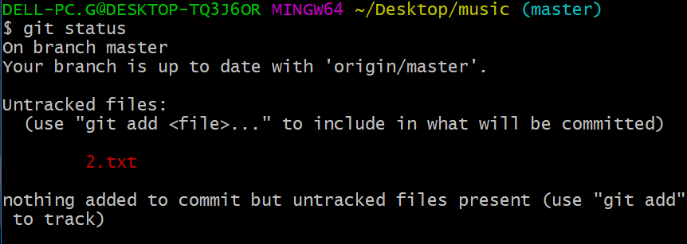
---
**注：** 在music文件夹中新增文件后查看状态显示红色

2.修改文件1.txt

 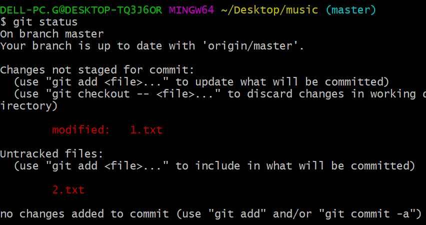

---
**注：** 在music文件夹中修改文件1.txt后查看状态显示红色并且前面有modified

 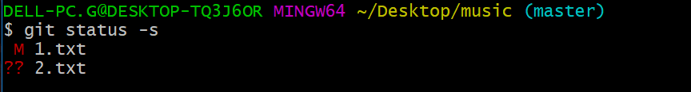
---
3.添加进暂存区

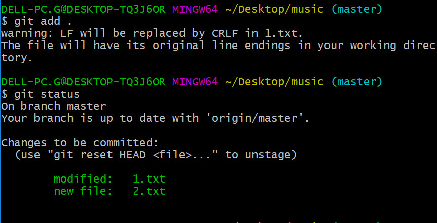
---
**注：** git add . 表示全部添加 ,  **.** 表示全部 ，添加暂存区域后会变成绿色 

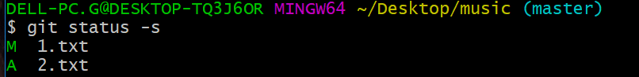
---

4.再 重新修改1.txt

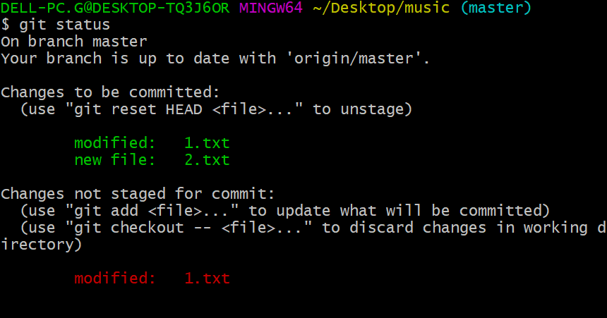

**注：** 上面绿色为暂存区中，如果1.txt再被更改下方还会出现红色的（第一次修改提交后再修改还会不同就会变红）

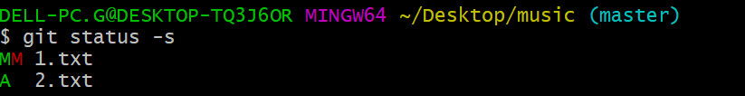
---
5.再次添加到暂存区并查看状态

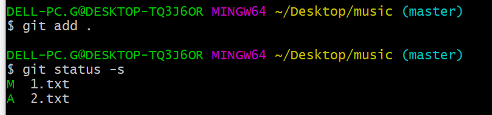
---
6.查看以往github 上的文件 和 文件信息

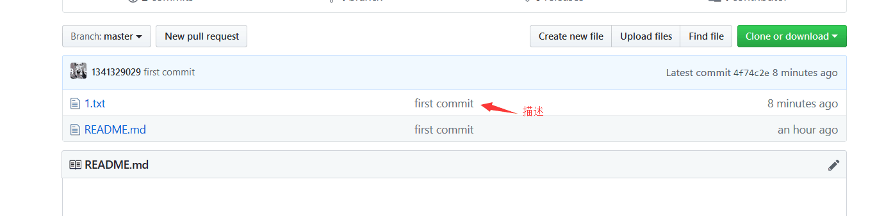

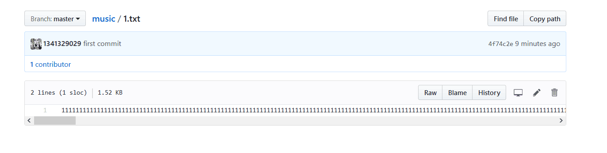

---
7.进行描述和提交

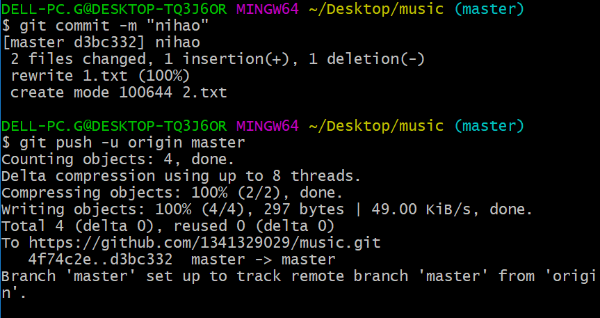
---
**注：**  描述也被更改了

8.查看现在的状态
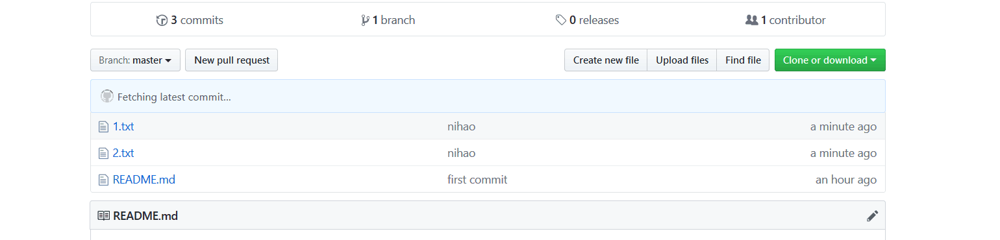
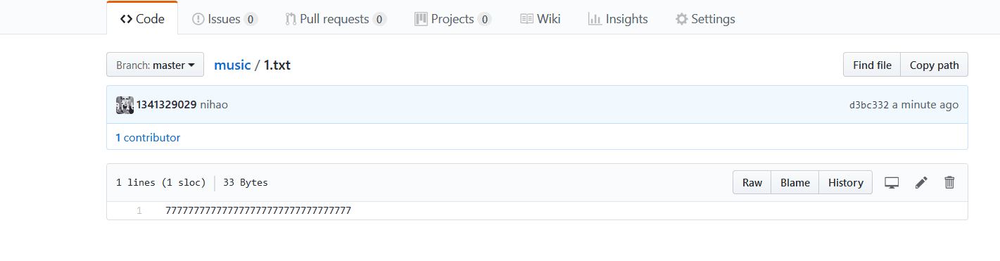
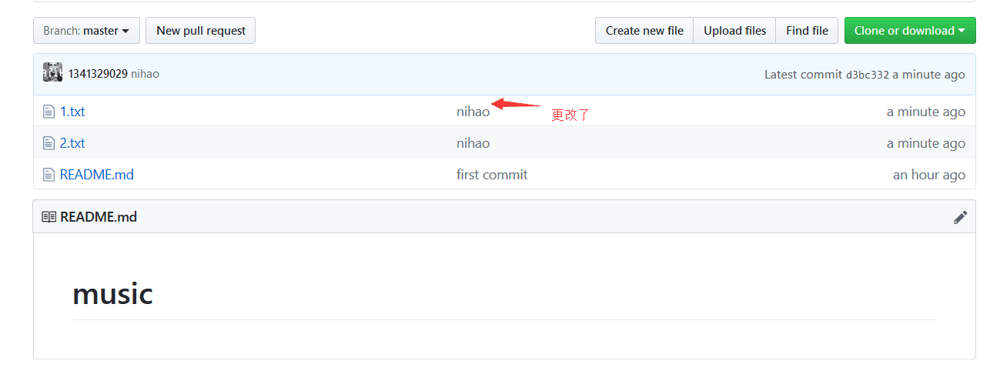

**注：**  文件1.txt的内容更改了，并且描述也都更改了

